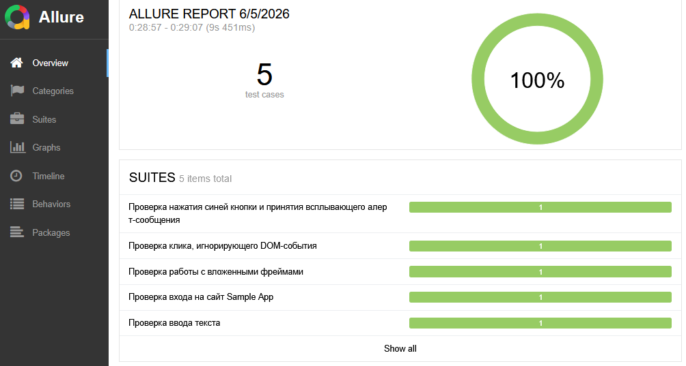
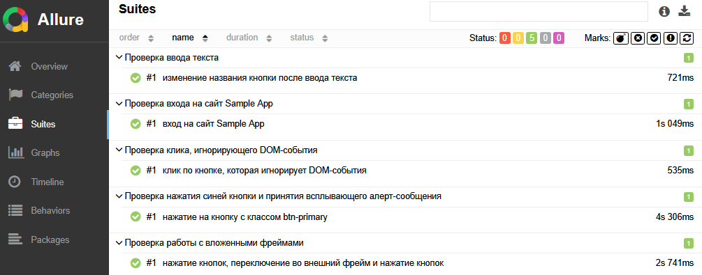

# Разработка автотестов для фронтенда

### Тестируемые темы:
Покрыты тестами 5 сценариев с сайта http://www.uitestingplayground.com/home:  
- Sample App (http://www.uitestingplayground.com/sampleapp)  
- Frames (http://www.uitestingplayground.com/frames)  
- Click (http://www.uitestingplayground.com/click)  
- Text Input (http://www.uitestingplayground.com/textinput)  
- Classattr (http://www.uitestingplayground.com/classattr)  

### Установка

Склонируйте репозиторий и войдите в директорию проекта:

```bash
git clone https://github.com/RasmuS2024/frontend_autotests.git
cd frontend_autotests
```

Как запускать тесты:
```bash
./gradlew test
```

### Allure-отчёт

После прогона тестов сформировать и открыть отчёт:

```bash
./gradlew allureReport --clean
./gradlew allureServe
```

- `allureReport` - генерирует HTML-отчёт в папку `build/reports/allure-report/` текущего проекта;
- `allureServe` - запускает локальный веб-сервер и открывает отчёт в браузере.

### Скриншоты Allure


рис. 1. Основное окно Allure


рис. 2. Запущенные тесты подробнее